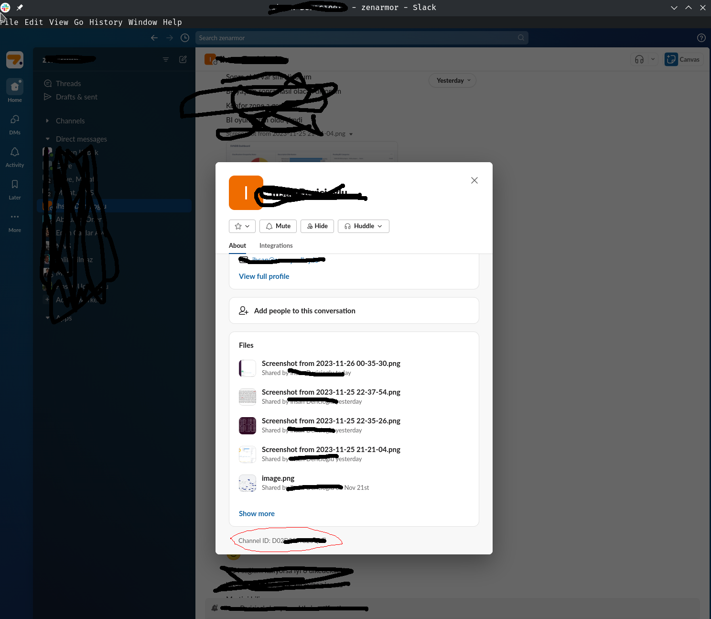
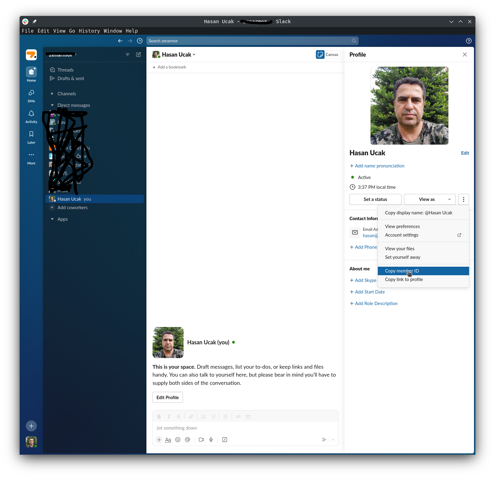

# Python Slack App

This Python script connects to Slack and deletes all messages in a specified channel using the Slack API and the `requests` library without slack python api.

it is simple.

## Prerequisites

- Python 3.x
- `requests` library

## Setting Up Your Slack App

### 1. Create a New Slack App

Go to https://api.slack.com/apps and click on the 'Create New App' button. Fill in the 'App Name' and 'Development Slack Workspace', then click on 'Create App'.

### 2. Generate a Slack API Token

Once your app is created, go to the 'OAuth & Permissions' page in the app settings. Under 'Scopes', add the necessary scopes for your app. For this application, you'll need the following scopes:

- `channels:read`
- `channels:history`
- `chat:write`

After adding the scopes, click on 'Install App to Workspace'. This will generate an OAuth Access Token. This token starts with `xoxb-`. Please keep this token secure and do not share it publicly.

### 3. Get Channel Id, My User id from Slack Application

## channel id
click to Home button left column.
click to user or channel in middle column
click to user name or channel name on top of right side.
You see bottom of opened form.

## my user id
click to Home button left column.
click to your user name in middle column
click to user name or channel name on top of right side.
click to view full profile middle of opened form.
click to member id of opened form.

### 3. To run this application, first install the necessary Python dependencies:

pip3 install -r requirements.txt

### 4. Then, you can run the application with:

python main.py

### LICENSE

MIT